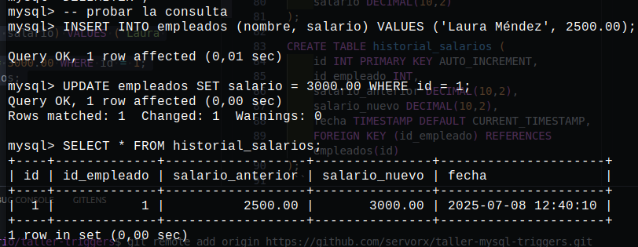
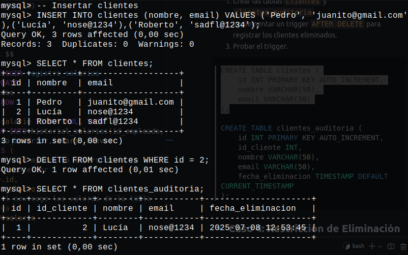

# 🚀 **Taller de Triggers en MySQL**

## 📌 **Objetivo**

En este taller, aprenderás a utilizar **Triggers** en MySQL a través de casos prácticos. Implementarás triggers para validaciones, auditoría de cambios y registros automáticos.

------

## **🔹 Caso 1: Control de Stock de Productos**

### **Escenario:**

Una tienda en línea necesita asegurarse de que los clientes no puedan comprar más unidades de un producto del stock disponible. Si intentan hacerlo, la compra debe **bloquearse**.

### **Tarea:**

1. Crear las tablas `productos` y `ventas`.
2. Implementar un trigger `BEFORE INSERT` para evitar ventas con cantidad mayor al stock disponible.
3. Probar el trigger.

```sql
CREATE TABLE productos (
    id INT PRIMARY KEY AUTO_INCREMENT,
    nombre VARCHAR(50),
    stock INT
);

CREATE TABLE ventas (
    id INT PRIMARY KEY AUTO_INCREMENT,
    id_producto INT,
    cantidad INT,
    FOREIGN KEY (id_producto) REFERENCES productos(id)
);
```
## solucion
```sql
-- 1
DELIMITER $$

CREATE TRIGGER prevent_stock
BEFORE INSERT 
ON ventas 
FOR EACH ROW 
BEGIN
  DECLARE stock_disponible INT;

  SELECT stock INTO stock_disponible
  FROM productos;

  IF NEW.cantidad > stock_disponible THEN 
    SIGNAL SQLSTATE '45000'
    SET MESSAGE_TEXT = 'stock no disponible';
  END IF;
END $$ 

DELIMITER ;
-- inserts para probar el trigger 
INSERT INTO productos (nombre, stock) VALUES ('Lapicero', 10);
INSERT INTO ventas (id_producto, cantidad) VALUES (1, 5);
INSERT INTO ventas (id_producto, cantidad) VALUES (1, 20); -- sale error
```


## **🔹 Caso 2: Registro Automático de Cambios en Salarios**

### **Escenario:**

La empresa **TechCorp** desea mantener un registro histórico de todos los cambios de salario de sus empleados.

### **Tarea:**

1. Crear las tablas `empleados` y `historial_salarios`.
2. Implementar un trigger `BEFORE UPDATE` que registre cualquier cambio en el salario.
3. Probar el trigger.

```sql
CREATE TABLE empleados (
    id INT PRIMARY KEY AUTO_INCREMENT,
    nombre VARCHAR(50),
    salario DECIMAL(10,2)
);

CREATE TABLE historial_salarios (
    id INT PRIMARY KEY AUTO_INCREMENT,
    id_empleado INT,
    salario_anterior DECIMAL(10,2),
    salario_nuevo DECIMAL(10,2),
    fecha TIMESTAMP DEFAULT CURRENT_TIMESTAMP,
    FOREIGN KEY (id_empleado) REFERENCES empleados(id)
);
```
```sql
-- 2
DELIMITER $$

CREATE TRIGGER registro_salarios
BEFORE UPDATE
ON empleados 
FOR EACH ROW
BEGIN 
  IF NEW.salario IS NOT NULL THEN 
    INSERT INTO historial_salarios(id_empleado,salario_anterior,salario_nuevo)
    VALUES (
      -- el old agarra la insersion de la tabla anterior
      OLD.id,
      OLD.salario,
      -- el new coge los valores de la tabla nueva 
      NEW.salario
    );
  END IF;
END $$  

DELIMITER ;
-- probar la consulta 
INSERT INTO empleados (nombre, salario) VALUES ('Laura Méndez', 2500.00);
UPDATE empleados SET salario = 3000.00 WHERE id = 1;
SELECT * FROM historial_salarios;
```

## **🔹 Caso 3: Registro de Eliminaciones en Auditoría**

### **Escenario:**

La empresa **DataSecure** quiere registrar toda eliminación de clientes en una tabla de auditoría para evitar pérdidas accidentales de datos.

### **Tarea:**

1. Crear las tablas `clientes` y `clientes_auditoria`.
2. Implementar un trigger `AFTER DELETE` para registrar los clientes eliminados.
3. Probar el trigger.

```sql
CREATE TABLE clientes (
    id INT PRIMARY KEY AUTO_INCREMENT,
    nombre VARCHAR(50),
    email VARCHAR(50)
);

CREATE TABLE clientes_auditoria (
    id INT PRIMARY KEY AUTO_INCREMENT,
    id_cliente INT,
    nombre VARCHAR(50),
    email VARCHAR(50),
    fecha_eliminacion TIMESTAMP DEFAULT CURRENT_TIMESTAMP
);
```
```sql
-- 4
```

## **🔹 Caso 4: Restricción de Eliminación de Pedidos Pendientes**

### **Escenario:**

En un sistema de ventas, no se debe permitir eliminar pedidos que aún están **pendientes**.

### **Tarea:**

1. Crear las tablas `pedidos`.
2. Implementar un trigger `BEFORE DELETE` para evitar la eliminación de pedidos pendientes.
3. Probar el trigger.

```sql
CREATE TABLE pedidos (
    id INT PRIMARY KEY AUTO_INCREMENT,
    cliente VARCHAR(100),
    estado ENUM('pendiente', 'completado')
);
```

